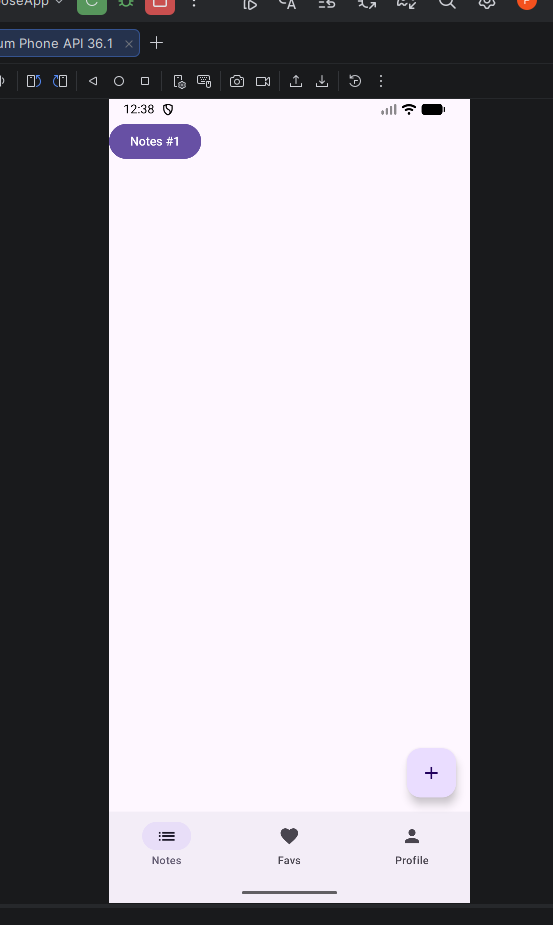
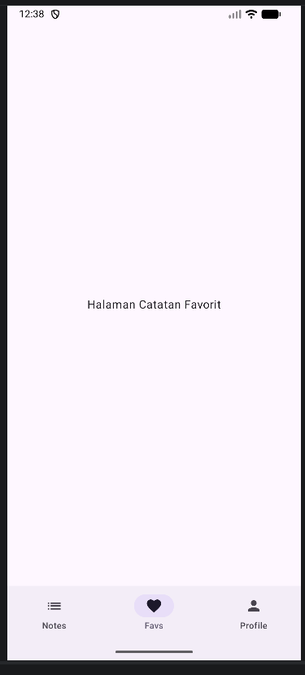
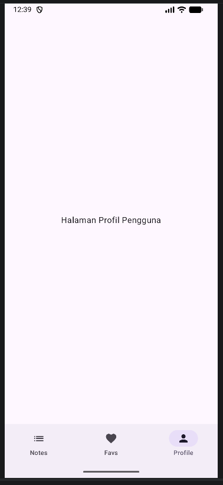
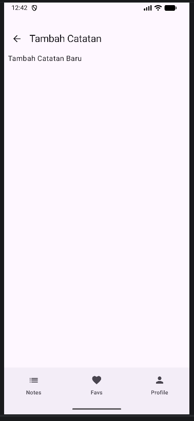
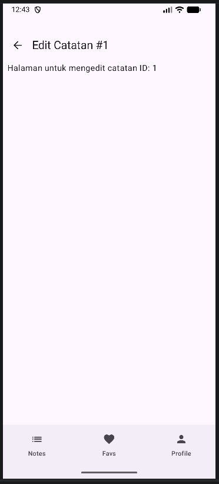
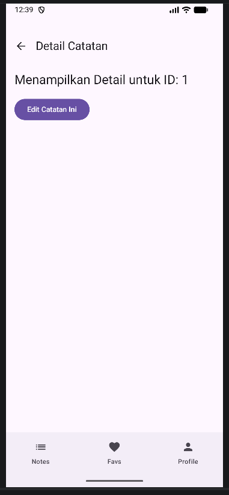

Tugas Praktikum Pertemuan 5: Navigasi Antar Layar

Repositori ini berisi hasil praktikum mata kuliah Pengembangan Aplikasi Mobile mengenai implementasi **Navigation Component** di Compose Multiplatform.

##  Fitur Utama & Alur Navigasi

Berikut adalah penjelasan mengenai fungsionalitas aplikasi berdasarkan screenshot yang tersedia:

### 1. Sistem Navigasi Utama (Bottom Navigation)
Aplikasi menggunakan `Scaffold` untuk mengelola navigasi panel bawah dengan tiga tab utama:
* **Notes Tab**: Halaman utama yang menampilkan daftar catatan dan tombol Floating Action Button (FAB) untuk menambah catatan.
* **Favorites Tab**: Halaman khusus untuk menampilkan catatan yang telah ditandai sebagai favorit.
* **Profile Tab**: Halaman informasi profil pengguna.

| Notes Tab | Favorites Tab | Profile Tab |
|---|---|---|
|  |  |  |

---

### 2. Pengelolaan Catatan (Add & Edit)
Navigasi antar layar juga mencakup fungsionalitas CRUD (Create/Update) dengan alur sebagai berikut:
* **Add Note**: Diakses melalui tombol (+) di halaman Notes. Menggunakan navigasi standar untuk berpindah ke formulir input.
* **Edit Note**: Diakses melalui halaman detail catatan. Alur ini mendemonstrasikan *Nested Navigation* atau perpindahan berlanjut dengan membawa data ID.

| Add Note Screen | Edit Note Screen |
|---|---|
|  |  |

---

### 3. Detail & Passing Arguments
Fitur ini mendemonstrasikan kemampuan aplikasi dalam mengirimkan data (ID) dari satu layar ke layar lainnya:
* **Halaman Note Detail**: Saat item pada daftar catatan diklik, aplikasi mengirimkan `noteId` sebagai argumen rute. Layar ini kemudian menangkap ID tersebut dan menampilkannya sebagai bukti data berhasil dikirim.

| Detail Catatan |
|---|
|  |

---

##  Struktur Project
Sesuai instruksi, kode diorganisir ke dalam paket-paket berikut:
* `navigation/`: Berisi `Screen.kt` (rute) dan `AppNavGraph.kt` (pusat navigasi).
* `screens/`: Berisi semua file UI untuk setiap halaman (Notes, Detail, Profile, dll).
* `components/`: Berisi komponen UI yang dapat digunakan kembali seperti `AppBottomBar.kt`.

##  Cara Menjalankan
1. Clone repositori ini.
2. Checkout ke branch `week-5`.
3. Buka di Android Studio Ladybug atau versi terbaru.
4. Run aplikasi pada emulator atau perangkat fisik.
